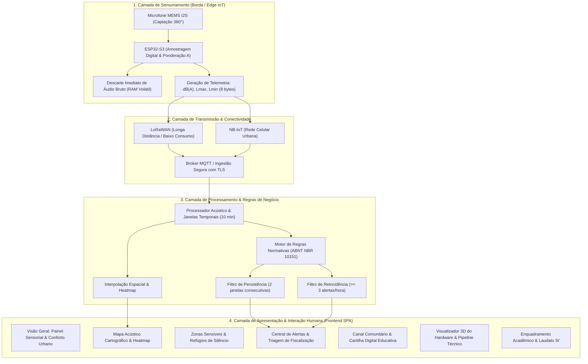

# Documento de Arquitetura e Catálogo de Recursos — Plataforma Sonitus

Este documento apresenta a especificação arquitetural completa e o catálogo de recursos da plataforma **Sonitus**, desenvolvida no âmbito da disciplina acadêmica *Questões Ambientais na Comunidade* (Universidade Católica do Salvador — UCSal, 2026).

---

## 1. Visão Geral da Arquitetura

O Sonitus é estruturado segundo um modelo conceitual multicamadas ponta a ponta, conectando a captação física no ambiente urbano até o consumo da informação pelo cidadão e pelo poder público (Sedur Salvador).



---

## 2. Detalhamento das 4 Camadas Arquiteturais

### 2.1 Camada 1: Sensoriamento e Processamento em Borda (Edge Computing)
- **Componente Físico Conceitual**: *Sonitus Node v1.2*, concebido como módulo compacto acoplado a luminárias ou postes de iluminação pública urbana.
- **Transdutor Acústico**: Microfone MEMS com interface digital I2S, sensibilidade calibrada e proteção perimétrica contra intempéries e vento.
- **Processador Central**: SoC Espressif ESP32-S3 (Dual-Core Xtensa LX7 com acelerador vetorial).
- **Cálculo Local de Níveis Sonoros**:
  - Amostragem acústica em alta frequência;
  - Aplicação do filtro de ponderação de frequência A ($R_A(f)$) segundo a IEC 61672-1;
  - Integração RMS em janelas contínuas para obtenção do Nível de Pressão Sonora Equivalente Ponderado em A ($L_{Aeq, T}$);
  - Captura de valor máximo instantâneo ($L_{max}$) e tempo em excesso ($\Delta t_{excesso}$).
- **Princípio Inegociável de Privacidade (*Privacy by Design*)**:
  - Inexistência de codecs de áudio (MP3, WAV, AAC, Opus);
  - Descarte imediato do sinal bruto em nanossegundos na memória volátil RAM;
  - Ausência de memória de armazenamento persistente não-volátil (SD Card/Flash de gravação).

### 2.2 Camada 2: Transmissão e Redes Urbanas IoT
- **Topologia de Rede**: Conectividade híbrida de baixo consumo e ampla cobertura (*LPWAN*):
  - **LoRaWAN (868/915 MHz)**: Utilizado em nós distribuídos em praças, parques e áreas residenciais calmas; pacotes compactados de telemetria (8 a 16 bytes);
  - **NB-IoT / LTE-M**: Utilizado em nós de avenidas troncais de alta densidade com alimentação contínua na rede elétrica;
  - **Wi-Fi Mesh**: Utilizado conceitualmente em campi universitários e parques fechados.
- **Protocolo de Ingestão**: Envio estruturado via MQTT / CoAP encapsulado em JSON criptografado.

### 2.3 Camada 3: Processamento, Análise e Inteligência Normativa
- **Base Normativa Integrada**:
  - ABNT NBR 10151:2019 (*Medição e avaliação de níveis de pressão sonora em áreas habitadas*);
  - Resolução CONAMA nº 01/1990;
  - Legislação Municipal de Combate à Poluição Sonora de Salvador (Decreto Municipal nº 23.250).
- **Parametrização por Tipologia de Área e Turno**:
  - **Áreas Estritamente Residenciais e Hospitalares**: Diurno $50\text{ dB(A)}$, Noturno $45\text{ dB(A)}$;
  - **Áreas Mistas predominantemente residenciais**: Diurno $55\text{ dB(A)}$, Noturno $50\text{ dB(A)}$;
  - **Áreas Comerciais / Vias de Tráfego**: Diurno $60\text{ dB(A)}$, Noturno $55\text{ dB(A)}$;
  - **Áreas Industriais**: Diurno $70\text{ dB(A)}$, Noturno $60\text{ dB(A)}$.
- **Motor de Regras Metodológicas do Protótipo**:
  - **Janela de Avaliação**: Blocos temporais de 10 minutos para consolidação de $L_{Aeq}$;
  - **Alerta de Persistência**: Emissão de alerta quando o limite da área/período é violado em **2 janelas consecutivas** (mínimo de 20 minutos de exposição continuada);
  - **Alerta de Reincidência**: Elevação para prioridade crítica quando ocorrem **3 alertas no mesmo sensor dentro de 1 hora**;
  - **Tratamento de Picos Isolados**: Sirenes de ambulância ou buzinas curtas são catalogadas como eventos esporádicos, sem acionamento de despacho de fiscalização.

### 2.4 Camada 4: Apresentação e Aplicação Web SPA
- **Framework e Linguagem**: React 19 + TypeScript + Vite.
- **Estilização e Design System**: CSS puro modular com tokens de design (`--color-*`, `--radius-*`, `--space-*`), paletas diurna/noturna e suporte a acessibilidade motora e sensorial.
- **Visualização 3D**: Three.js WebGL integrado com lazy-loading e desativação em modo de movimento reduzido.

---

## 3. Catálogo de Recursos da Plataforma

A plataforma disponibiliza 7 seções especializadas, acessíveis por menu horizontal e gaveta mobile:

```
┌────────────────────────────────────────────────────────────────────────┐
│                        SONITUS — BARRA SUPERIOR                        │
│ [Logo] [Visão Geral] [Mapa] [Zonas Sensíveis] [Comunidade] [Alertas] ...│
│ [Turno: Manhã | Tarde | Noite] [Movimento Reduzido] [Tema Claro/Escuro] │
└────────────────────────────────────────────────────────────────────────┘
```

---

### Recurso 1: Visão Geral (Centro de Planejamento Sensorial e Conforto Urbano)
- **Finalidade**: Permitir que cidadãos (especialmente famílias com pessoas autistas ou idosos) planejem deslocamentos com previsibilidade acústica.
- **Funcionalidades**:
  - **Diagnóstico Acústico em Tempo Real (Simulado)**: Exibe a média instantânea da cidade em decibéis e o estado geral do ambiente sonoro;
  - **Indicador do "Melhor Horário para Sair"**: Identifica o intervalo de menor fluxo acústico estimado do dia (ex.: 02:00h da madrugada ou 10:00h da manhã);
  - **Destaque do Refúgio de Silêncio do Momento**: Atalho imediato para a estação de menor nível sonoro na cidade (ex.: Mirante do Lago com 42 dB);
  - **Curva Estimada de Ruído em 24 Horas**: Gráfico vetorial SVG dinâmico apresentando a oscilação suave da pressão sonora das 06h às 22h com marcação do patamar ideal ($< 50\text{ dB}$);
  - **Busca Rápida de Locais e Filtros**: Filtros contextuais (*Agora*, *Próximas 2h*, *Parques e jardins*, *Cafés silenciosos*);
  - **Recomendações Sensoriais de Especialistas**: Dicas práticas de conforto (preparação com abafadores, pausas em áreas verdes e respeito ao ritmo sensorial).

---

### Recurso 2: Mapa Acústico Interativo (Protagonista Cartográfico)
- **Finalidade**: Mapear visualmente a dispersão sonora de Salvador com cartografia personalizada.
- **Funcionalidades**:
  - **18 Estações Georreferenciadas**: Dispersão por bairros reais de Salvador (Barra, Rio Vermelho, Pelourinho, Campo Grande, Comércio, Brotas, Ondina, Pituba, etc.);
  - **Camada de Heatmap de Ruído**: Alternador visual que desenha gradientes de calor baseados no nível $L_{Aeq}$ atual de cada nó;
  - **Camada de Zonas Sensíveis**: Ícones institucionais destacados no mapa com buffers de atenção;
  - **Filtros Combinados**: Filtragem por distrito, por nível de decibéis ($<55$, $55\text{--}70$, $>70$) e por categoria do solo;
  - **Gaveta Lateral de Inspeção**: Ao clicar em qualquer nó do mapa, abre-se uma gaveta detalhada com:
    - Nível $L_{Aeq}$ atual, $L_{max}$ e $L_{min}$;
    - Classificação conforme a NBR 10151 para o período corrente;
    - Histórico das últimas horas;
    - Recomendações personalizadas para o ponto.

---

### Recurso 3: Zonas Sensíveis & Oásis de Conforto
- **Finalidade**: Dar visibilidade a pontos que requerem silêncio por imperativo de saúde ou inclusão.
- **Funcionalidades**:
  - **Monitoramento de Estabelecimentos Protegidos**: Acompanhamento do entorno acústico de hospitais (ex.: Hospital Português, HGE), escolas municipais e centros de convivência TEA;
  - **Catálogo de Oásis Sonoros**: Lista de parques urbanos e praças arborizadas classificadas como refúgios para autorregulação sensorial;
  - **Métricas de Conforto**: Decibéis médios, horários recomendados de menor fluxo e orientações de permanência.

---

### Recurso 4: Alertas & Apoio à Priorização da Fiscalização (Sedur)
- **Finalidade**: Oferecer inteligência operacional para a Sedur Salvador priorizar equipes de campo onde há persistência ou reincidência de abuso sonoro.
- **Funcionalidades**:
  - **Painel de Regras Metodológicas**: Exibição transparente dos parâmetros de triagem (janela de 10 min, 2 janelas para persistência, 3 alertas/hora para reincidência);
  - **Fila de Alertas Operacionais**: Listagem de ocorrências com status dinâmico (*Novo*, *Em Análise*, *Normalizado*);
  - **Tratamento de Picos Isolados**: Distinção clara de que eventos transitórios não disparam viaturas de fiscalização;
  - **Cláusula de Não-Punibilidade Automática**: Alerta destacado em conformidade com o rigor acadêmico (*"Apoio à Fiscalização ≠ Sanção Automática"* — O sistema não emite multas nem substitui o auto de infração formal).

---

### Recurso 5: Comunidade & Educação Ambiental
- **Finalidade**: Fomentar a cidadania ambiental e complementar dados técnicos com a vivência sensorial humana.
- **Funcionalidades**:
  - **Canal de Relatos Participativos Anônimos**:
    - Formulário estruturado com seleção de bairro, fonte geradora (som automotivo, bares, obras, tráfego), nível de incômodo percebido e turno;
    - **Zero Coleta de Dados Pessoais**: Em conformidade total com a LGPD, o cidadão não fornece nome, e-mail, telefone ou documento;
  - **Correlação Técnico-Comunitária**:
    - Cada relato registrado é confrontado com as medições dos sensores instalados na área, identificando se houve confirmação por decibéis elevados ou se trata-se de sensibilidade específica em área silenciosa;
  - **Cartilha Digital Multitemática (3 Capítulos)**:
    - *Capítulo 1*: Poluição sonora, estresse cardiovascular e distúrbios do sono;
    - *Capítulo 2*: Neurodiversidade, processamento sensorial e sobrecarga auditiva no TEA (Lei Berenice Piana nº 12.764/2012);
    - *Capítulo 3*: Bem-estar animal, pânico causado por fogos de artifício e impactos na fauna urbana;
  - **Dicas Cidadãs de Boa Convivência**: Guia de etiqueta acústica para condomínios, trânsito e estabelecimentos.

---

### Recurso 6: Privacidade & Tecnologia (Sensor 3D & Telemetria)
- **Finalidade**: Apresentar a viabilidade tecnológica da solução proposta e auditar as garantias de privacidade.
- **Funcionalidades**:
  - **Visualizador 3D Interativo (Sonitus Node v1.2)**:
    - Modelo tridimensional interativo renderizado em WebGL (Three.js);
    - Rotação livre em três eixos (Pitch, Yaw, Roll);
    - Visualização dos componentes internos (microfone MEMS, chip ESP32-S3, rádio LoRaWAN, anel difusor e carcaça estanque);
  - **Diagrama de Fluxo de Dados Ponta a Ponta**: 5 etapas explicativas da propagação da onda mecânica à ação pública;
  - **Pilares de Privacidade por Concepção**:
    - Impossibilidade física de escuta (sem codecs);
    - Memória zero de armazenamento;
    - Restrição ao espaço público sem monitorar residências particulares.

---

### Recurso 7: Sobre o Projeto (Enquadramento Acadêmico)
- **Finalidade**: Registrar os fundamentos científicos, normativos e éticos da plataforma.
- **Funcionalidades**:
  - **Ficha Técnica Acadêmica**: Universidade Católica do Salvador (UCSal), disciplina *Questões Ambientais na Comunidade*, orientação da Profa. Dra. Janine Melo e autoria discente;
  - **Diagnóstico Real de Salvador**: Estatísticas oficiais de 2026 da Sedur (mais de 48 mil denúncias anuais de poluição sonora registradas na capital baiana);
  - **Fundamentação na Encíclica *Laudato Si'***: Integração dos parágrafos nº 44 e 150 do Papa Francisco, fundamentando o ruído como poluição degradadora da qualidade de vida e a ecologia integral como dever comunitário;
  - **Quadro Comparativo de Soluções**: Matriz diferenciando o Sonitus do NoiseCapture (França), SONYC (Nova York) e do radar sonoro de São José dos Campos.

---

## 4. Recursos Transversais de Acessibilidade e Experiência

| Recurso Transversal | Como Funciona | Benefício para o Usuário |
| :--- | :--- | :--- |
| **Alternador de Turnos (Manhã / Tarde / Noite)** | Atualiza o estado global `period` recalculando decibéis, limites da NBR 10151 e alertas. | Permite comparar a cidade no período diurno versus a maior exigência do silêncio noturno. |
| **Modo Movimento Reduzido (*Reduced Motion*)** | Botão no cabeçalho que ativa classe global congelando animações, ondas de radar e rotação 3D. | Protege usuários neurodivergentes, pessoas com labirintite ou sensibilidade a estímulos visuais cinéticos. |
| **Alternância de Tema (Claro / Escuro)** | Modifica o atributo `data-theme` alternando contraste sem perder legibilidade. | Reduz fadiga visual em ambientes escuros e melhora conforto de leitura. |
| **Responsividade Adaptativa para 3 Dispositivos** | Sub-barra flexível para iPhone SE (375px), colunas fluidas para tablets (800px) e dashboard expandido para desktop (1080p). | Acesso universal para cidadãos em qualquer smartphone sem barras de rolagem horizontal indesejadas. |
| **Foco e Teclado WCAG 2.1** | Contorno visível de foco e atributos ARIA (`aria-pressed`, `aria-expanded`, `role="status"`). | Acessibilidade completa para leitores de tela e pessoas com limitações motoras. |

---

## 5. Pilha Tecnológica e Dependências

```json
{
  "runtime": "Node.js 22+",
  "bundler": "Vite 8.3",
  "framework": "React 19.2 (com React DOM)",
  "language": "TypeScript 5.9",
  "graphics3d": "Three.js 0.183",
  "icons": "Lucide React 1.16",
  "testingVisual": "Puppeteer 24.40 + Firefox ESR (Headless)"
}
```
