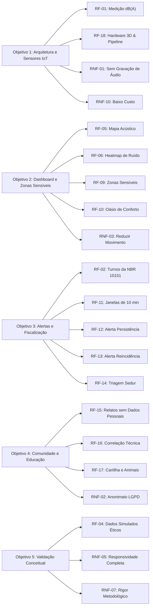

# Matriz de Requisitos Funcionais e Não Funcionais — Plataforma Sonitus

Este documento apresenta a especificação e o rastreamento formal dos **Requisitos Funcionais (RF)** e **Requisitos Não Funcionais (RNF)** da plataforma **Sonitus**, estabelecidos a partir do **Projeto Parcial acadêmico** (UCSal — *Questões Ambientais na Comunidade*, 2026), do documento de contexto (`docs/sonitus-context.md`) e da implementação atual da plataforma.

Cada requisito é classificado com identificador único, descrição normativa, origem metodológica/acadêmica, status de implementação na plataforma e observações técnicas detalhadas.

---

## 1. Resumo Executivo do Status

| Categoria | Total | Implementado (Protótipo/Simulado) | Parcialmente Implementado | Não Implementado (Fase Futura em Campo) |
| :--- | :---: | :---: | :---: | :---: |
| **Requisitos Funcionais (RF)** | 18 | 17 | 1 | 0 |
| **Requisitos Não Funcionais (RNF)** | 12 | 10 | 2 | 0 |
| **Total** | **30** | **27** | **3** | **0** |

> [!NOTE]
> Conforme definido nas premissas acadêmicas do Projeto Parcial (Etapas 1 a 7 e Seção 3.4 de Limitações), os requisitos técnicos de hardware físico e telecomunicação em postes reais são demonstrados funcionalmente por **modelagem 3D, telemetria simulada e pipeline conceitual**, sem sensores físicos instalados nesta entrega parcial.

---

## 2. Requisitos Funcionais (RF)

### 2.1 Módulo: Sensoriamento e Gestão de Dados Acústicos

| ID | Nome do Requisito | Descrição | Origem no Projeto Parcial | Status | Detalhamento da Implementação |
| :--- | :--- | :--- | :--- | :---: | :--- |
| **RF-01** | Medição Conceitual de Pressão Sonora em dB(A) | Coletar e registrar níveis contínuos de pressão acústica expressos em dB(A) com cálculo de $L_{Aeq}$ para janelas temporais definidas. | Etapa 2 (Arquitetura) e Etapa 3 (Simulação) | **Implementado** *(Simulado)* | Implementado em `src/data/noiseData.ts` gerando séries históricas e cálculos de $L_{Aeq}$ para 18 estações em Salvador. |
| **RF-02** | Classificação de Período e Turno (Diurno / Noturno) | Permitir a seleção e alternância dinâmica entre os períodos do dia (Manhã, Tarde e Noite), adaptando os critérios e os limites da NBR 10151. | Seção 1.2, Etapa 3 e Etapa 5 | **Implementado** | Alternador no cabeçalho (`Header.tsx`) recalcula as médias, picos e limites da cidade conforme o turno selecionado. |
| **RF-03** | Registro e Distinção de Picos Acústicos Isolados | Registrar eventos transitórios e picos esporádicos (ex.: sirenes, buzinas) separando-os metodologicamente do ruído contínuo $L_{Aeq}$. | Seção 1.2, Etapa 3 e Etapa 5 | **Implementado** | Visualização de gauges com $L_{Aeq}$, pico máximo ($L_{max}$) e tempo em excesso, sem disparar alertas indevidos por picos isolados. |
| **RF-04** | Simulação Sintética Parametrizada de Dados | Gerar artificialmente dados acústicos ancorados em normas técnicas, identificando-os explicitamente como fictícios/simulados em toda a interface. | Seção 2 (Escopo) e Etapa 3 | **Implementado** | Badges e avisos de "Dados 100% Simulados" exibidos em todas as abas e cabeçalhos, atendendo ao rigor ético acadêmico. |

---

### 2.2 Módulo: Cartografia e Visualização Georreferenciada (Dashboard)

| ID | Nome do Requisito | Descrição | Origem no Projeto Parcial | Status | Detalhamento da Implementação |
| :--- | :--- | :--- | :--- | :---: | :--- |
| **RF-05** | Mapa Acústico Interativo com Estações de Monitoramento | Exibir cartografia com georreferenciamento de pontos de medição em vias de tráfego, áreas comerciais, zonas residenciais e hospitalares. | Objetivo Específico 2 e Etapa 4 | **Implementado** | Implementado em `src/sections/NoiseMapSection.tsx` com 18 nós acústicos mapeados com coordenadas e raio de dispersão. |
| **RF-06** | Camada de Mancha de Ruído (*Heatmap*) | Fornecer camada visual de calor representando a intensidade do som na malha urbana por gradação de cor (verde a vermelho). | Etapa 4 (Prototipação) | **Implementado** | Alternador de camada `Heatmap de Ruído` projeta gradientes visuais baseados na interpolação das intensidades dos nós. |
| **RF-07** | Filtragem Multicritério de Pontos Sonoros | Permitir a busca e filtragem de estações por nome do logradouro, distrito urbano, faixa de intensidade de decibéis e categoria de uso do solo. | Etapa 4 (Prototipação) | **Implementado** | Barra de busca e filtros rápidos integrados com atualização dinâmica dos marcadores e contadores. |
| **RF-08** | Painel de Inspeção Detalhada do Ponto Sonoro | Disponibilizar gaveta ou painel lateral ao selecionar um sensor, detalhando $L_{Aeq}$ atual, $L_{max}$, histórico diário e conformidade legal. | Etapa 4 (Prototipação) | **Implementado** | Drawer lateral exibe curva temporal, status frente à NBR 10151, endereço e orientações para o cidadão. |
| **RF-09** | Identificação e Destaque de Zonas Sensíveis | Mapear e sinalizar visualmente hospitais, clínicas, escolas, centros de atendimento a PcD/TEA e áreas verdes com limites acústicos mais estritos. | Objetivo Específico 2 e Seção 4 do Contexto | **Implementado** | Implementado em `src/sections/SensitiveZonesSection.tsx` e camada dedicada no mapa com cards e buffers de proteção. |
| **RF-10** | Catálogo de Oásis de Conforto Acústico | Identificar e listar refúgios urbanos e áreas tranquilas ($< 55\text{ dB}$) para planejamento de trajetos calmos e descompressão sensorial. | Seção 5 do Contexto e Guia de Uso | **Implementado** | Catálogo de refúgios sonoros na Visão Geral e nas Zonas Sensíveis com melhor horário para visita e índice de conforto. |

---

### 2.3 Módulo: Sistema de Alertas e Apoio à Fiscalização (Sedur)

| ID | Nome do Requisito | Descrição | Origem no Projeto Parcial | Status | Detalhamento da Implementação |
| :--- | :--- | :--- | :--- | :---: | :--- |
| **RF-11** | Avaliação em Janelas Temporais de 10 Minutos | Segmentar a avaliação contínua em blocos de 10 minutos para verificação da estabilidade acústica. | Etapa 5 (Sistema de Alertas) | **Implementado** | Modelagem das janelas de medição expressas em `src/sections/AlertsSection.tsx` e `src/data/noiseData.ts`. |
| **RF-12** | Disparo de Alerta de Persistência | Gerar alerta de apoio à fiscalização quando o limite normativo da área/período for excedido em duas janelas consecutivas (20 min). | Etapa 5 (Sistema de Alertas) | **Implementado** | Regra automática implementada com badge informativo e distinção visual na triagem de ocorrências. |
| **RF-13** | Sinalização de Ocorrência Reincidente | Classificar e priorizar eventos com status de reincidência quando ocorrerem três ou mais alertas no mesmo ponto dentro do intervalo de 1 hora. | Etapa 5 (Sistema de Alertas) | **Implementado** | Alertas reincidentes destacados com prioridade máxima e contagem de reincidências/hora no dashboard. |
| **RF-14** | Painel de Triagem Operacional para Fiscalização | Exibir fila de alertas com localidade, duração, decibéis observados, limite excedido e status (Novo, Em Análise, Normalizado). | Objetivo Específico 3 e Etapa 5 | **Implementado** | Central de triagem operacional com filtros por status e ênfase de que o sistema apoia o poder público sem multas automáticas. |

---

### 2.4 Módulo: Participação Comunitária e Educação Ambiental

| ID | Nome do Requisito | Descrição | Origem no Projeto Parcial | Status | Detalhamento da Implementação |
| :--- | :--- | :--- | :--- | :---: | :--- |
| **RF-15** | Canal de Relatos Comunitários sem Dados Pessoais | Fornecer formulário para cidadãos reportarem incômodo acústico (bairro, tipo de fonte, percepção, período) sem coletar nome, CPF ou contato. | Objetivo Específico 4, Etapa 6 e LGPD | **Implementado** | Implementado em `src/sections/CommunityEducationSection.tsx` com validação de campos anônimos e feed em tempo real. |
| **RF-16** | Correlação Técnico-Comunitária | Confrontar relatos subjetivos de cidadãos com as telemetrias dos sensores da vizinhança para contextualizar a sensibilidade perceptual. | Seção 6 do Contexto e Etapa 6 | **Implementado** | Cada relato exibe correlação automática com o sensor correspondente (ex.: *"Sensor SNS-002: 74 dB(A)"*). |
| **RF-17** | Cartilha Digital e Materiais Educativos Multitemáticos | Disponibilizar material educativo acessível abordando impactos na saúde, hipersensibilidade auditiva no TEA, bem-estar animal e ecologia integral. | Objetivo Específico 4 e Etapa 6 | **Implementado** | Cartilha digital interativa com 3 capítulos temáticos, dicas práticas e citações da Encíclica *Laudato Si'* (nº 44 e 150). |

---

### 2.5 Módulo: Hardware IoT e Telemetria

| ID | Nome do Requisito | Descrição | Origem no Projeto Parcial | Status | Detalhamento da Implementação |
| :--- | :--- | :--- | :--- | :---: | :--- |
| **RF-18** | Visualizador Tridimensional e Pipeline do Nó Sensor | Exibir modelo 3D conceitual do sensor acústico de baixo custo (ESP32-S3 + MEMS) e detalhar o pipeline de transmissão IoT (LoRaWAN/MQTT). | Objetivo Específico 1 e Etapa 2 | **Implementado** *(Conceitual)* | Implementado em `src/sections/TechnologySection.tsx` com renderização WebGL Three.js e diagrama de arquitetura. |

---

## 3. Requisitos Não Funcionais (RNF)

| ID | Categoria | Descrição do Requisito | Critério de Aceitação / Norma | Status | Detalhamento da Implementação |
| :--- | :--- | :--- | :--- | :---: | :--- |
| **RNF-01** | **Privacidade e LGPD** | *Privacy by Design*: O sistema não deve gravar áudio, registrar conversas nem armazenar arquivos de som. | Art. 6º da Lei nº 13.709/2018 (LGPD) e Etapa 2 | **Implementado** | Apenas valores numéricos escalares em dB(A) são processados. Inexistência de codecs de áudio ou escuta ativa. |
| **RNF-02** | **Privacidade Comunitária** | O canal de relatos não deve solicitar nem armazenar dados pessoais identificáveis (nome, telefone, IP, e-mail). | Princípio da Minimização de Dados (LGPD) | **Implementado** | Formulário comunitário estritamente desprovido de campos pessoais; relatos salvos anonimamente em memória. |
| **RNF-03** | **Acessibilidade e Neurodiversidade** | A interface deve possuir modo de "Movimento Reduzido" para conforto visual de pessoas neurodivergentes e sensíveis a movimento. | Lei Brasileira de Inclusão (Lei nº 13.146/2015) e WCAG 2.1 | **Implementado** | Botão global no Header ativa `prefers-reduced-motion`, congelando animações, ondas de radar e rotação 3D. |
| **RNF-04** | **Acessibilidade Visual e Contraste** | Fornecer alternância de tema Claro / Escuro com contraste tipográfico adequado e legibilidade em todas as abas. | WCAG 2.1 nível AA e Etapa 4 | **Implementado** | Variáveis CSS em `:root` e `[data-theme='dark']` com paletas validadas ergonomicamente para leitura diurna e noturna. |
| **RNF-05** | **Responsividade Multiplataforma** | A aplicação deve ser totalmente responsiva e operacional em dispositivos móveis compactos (375px), tablets (800px) e desktops (1080p). | Resoluções de referência: iPhone SE, Galaxy Tab S10 FE, Desktop FullHD | **Implementado** | Validado visualmente via Puppeteer headless; sub-barra mobile dedicada e contenção de grid (`min-width: 0`). |
| **RNF-06** | **Conformidade Normativa Acústica** | As faixas de decibéis e os limites de referência devem seguir estritamente as diretrizes da norma brasileira de poluição sonora. | ABNT NBR 10151:2019 e Resolução CONAMA nº 01/1990 | **Implementado** | Limites parametrizados por zona (residencial, mista, hospitalar) e período (diurno 50–55 dB / noturno 45–50 dB). |
| **RNF-07** | **Clareza Metodológica e Integridade Acadêmica** | A plataforma não deve simular falsamente fiscalização ou multas reais; distinção expressa entre dados simulados e dados oficiais. | Seção 2 (Escopo Acadêmico) e Seção 13 | **Implementado** | Avisos explícitos em todas as seções: "Dados Simulados", "Apoio à Fiscalização ≠ Sanção Automática". |
| **RNF-08** | **Desempenho e Carregamento Rápido** | A aplicação deve carregar rapidamente em redes móveis e computadores modestos, utilizando divisão eficiente de código. | First Contentful Paint $< 1.8\text{s}$; Lazy Loading de módulos pesados | **Implementado** | Módulo Three.js 3D carregado sob demanda via `React.lazy()` e `Suspense`, mantendo o bundle inicial leve. |
| **RNF-09** | **Navegação por Teclado e Semântica Web** | Toda a navegação e controles interativos devem ser operáveis por teclado com atributos ARIA explicativos. | WCAG 2.1 (Operável) e HTML5 semântico | **Implementado** | Menus com `aria-expanded`, botões de turno com `aria-pressed`, tags `<header>`, `<nav>`, `<main>` e `<aside>`. |
| **RNF-10** | **Viabilidade Econômica do Hardware Conceitual** | A proposta conceitual do sensor deve priorizar componentes de baixo custo para permitir replicação e escala pelo poder público. | Seção 3.3 (Sustentabilidade Financeira) | **Implementado** *(Conceitual)* | Arquitetura especifica microcontrolador ESP32-S3 e microfone MEMS I2S com custo estimado inferior a US$ 35 por nó. |
| **RNF-11** | **Tolerância a Intempéries e Interferências Ambientais** | O nó de sensoriamento deve prever encapsulamento protetor contra intempéries (chuva e vento) para uso contínuo em postes. | Seção 3.4 (Limitações Previstas) | **Parcialmente Implementado** *(Modelagem 3D)* | Modelado na tela 3D com case IP65 e proteção contra vento; validação de calibração física em campo pendente para fases futuras. |
| **RNF-12** | **Conectividade e Telemetria Resiliente em Redes Urbanas** | O sistema de transmissão deve suportar protocolos de baixo consumo energético e longo alcance (LoRaWAN / NB-IoT / MQTT). | Etapa 2 (Transmissão) | **Parcialmente Implementado** *(Simulação)* | Payload JSON e tópicos MQTT modelados na telemetria técnica; comunicação com gateways de rádio reais reservada para fase futura. |

---

## 4. Matriz de Rastreabilidade: Objetivos Específicos × Requisitos

Esta matriz correlaciona cada um dos cinco objetivos específicos do documento acadêmico aos requisitos implementados:

---

## 5. Próximos Passos e Requisitos Futuros (Projeto Final)

Para a continuidade da pesquisa em direção ao trabalho final e eventual fase piloto em campo, os seguintes requisitos parciais deverão ser elevados a testes práticos:
1. **Calibração Acústica em Campo**: Ajuste de curvas de ponderação A com sonômetro calibrador classe 1/2 segundo a NBR 10151;
2. **Tratamento de Artefatos Climáticos**: Filtro de vento (*windscreen*) e compensação algorítmica de ruídos de chuva;
3. **Acordo de Cooperação Técnica**: Integração das filas de triagem via API com o sistema de despacho da Sedur Salvador;
4. **Alimentação Fotovoltaica em Campo**: Dimensionamento de micro-painel solar de 5W e bateria LiFePO4 para autonomia em postes sem fiação dedicada.
